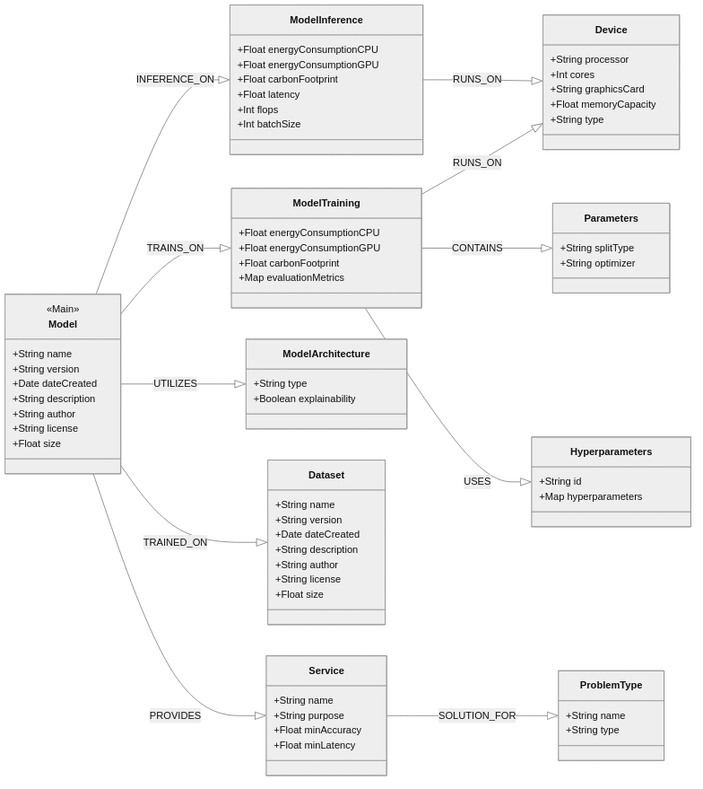

# ML Model Metadata Knowledge Graph

This project helps manage and analyze information about machine learning models (model metadata) by storing it in a knowledge graph database. When training ML models, we collect important details like how well the model performs, how much energy it uses, what kind of hardware it needs, and what data it was trained on. By organizing all this information in a graph structure, we make it easy to find the right model for specific needs, compare different models, and understand their environmental impact. The project includes schemas on how to collect this metadata in a standard format and store it in a Neo4j graph database, which is a knowledge graph that can then be queried to answer questions about the models. It enables use cases presented below.

## Installation

1. Clone the repository:
2. Install dependencies:
3. Configure environment variables:
```bash
cp .env.template .env
```
Edit `.env` with your Neo4j credentials and desired configuration settings. (See how to deploy a Neo4j instance using Docker below)

The following environment variables can be configured in your `.env` file:

```env
# Neo4j Configuration
NEO4J_URI=bolt://localhost:7687
NEO4J_USER=neo4j
NEO4J_PASSWORD=your-password-here

# Application Settings
JSON_DIR=./model_descriptors
```

## Usage

1. Run the following command to deploy a Neo4j instance using Docker (optional):

```bash
docker run --name neo4j -p 7474:7474 -p 7687:7687 -d -e NEO4J_AUTH=neo4j/your-password-here neo4j:latest
```

2. Place your ML model metadata JSON files in the configured `JSON_DIR` directory.
3. Ensure your JSON files conform to the schema defined in `json_schema/model_card_schema.json`. You can use the `json_schema/schema_validator.py` script to validate your JSON files.
4. Run the script to insert metadata from JSON files into the Neo4j knowledge graph:
```bash
python json_to_KG.py
```

## Graph Structure

The knowledge graph implements the following structure:

### Node Types

- **Model**: Core node containing model name, version, description, and author information
- **Dataset**: Training data information including name, size, version, and date
- **Service**: Defines the service the model provides (e.g., localization, text generation)
- **ProblemType**: Specifies the ML problem type (regression, classification, etc.)
- **ModelArchitecture**: Details about the model's architecture
- **Device**: Hardware specifications for training/inference
- **ModelTraining**: Training metrics and parameters
- **ModelInference**: Inference performance data

### Relationships

- **trainedOn**: Connects Model to Dataset
- **provides**: Links Model to Service
- **basedOn**: Associates Model with ModelArchitecture
- **runsOn**: Connects ModelTraining/ModelInference to Device
- **trainsOn**: Links Model to ModelTraining
- **solutionFor**: Connects Service to ProblemType

## Ontology Diagram

The following diagram illustrates the ontology of the knowledge graph:




## Use Cases

The ML model metadata knowledge graph enables several key applications, from environmental impact optimization to intelligent model deployment and natural language-based exploration.

### Green Computing Applications
- Intelligent selection of ML models based on energy consumption and carbon footprint metrics through both Neo4j queries and potentially graph neural networks (GNN)
- Analysis of how model architectures and datasets affect carbon footprint
- Workload shifting capabilities to reduce overall environmental impact

### Intelligent ML Model Orchestration
- Comprehensive knowledge of training and inference metrics (latency, computational complexity, carbon footprint, accuracy)
- Possible integration with MLOps systems for optimized training and deployment on distributed infrastructure
- This could enhance performance on edge devices through improved model orchestration and improve resource utilization based on infrastructure capabilities

### RAG
- Natural language interaction through Graph Retrieval Augmented Generation (RAG)
- Generation of insights about model relationships and performance patterns
- Interactive exploration of model metadata through graph-based queries

## License

This project is licensed under the [BSD-3 Clause License](LICENSE) - see the LICENSE file for details.

## Citation

## Acknowledgments
